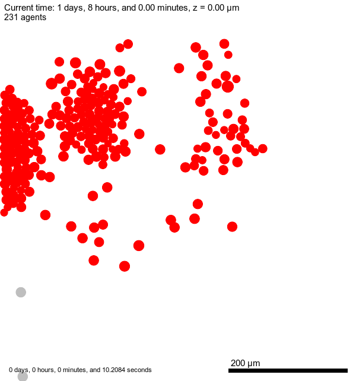

# test_param_sweep

From the cloned repo:
```
cd ~/git/test_param_sweep/PhysiCell-1.14.2
make -j2   # this will create the "project" executable
make save PROJ=MODEL1   # optional, if you really plan to have multiple models

cp beta/params_run.py params_run.py
cp beta/params_run.txt params_run.txt
```

Edit `params_run.txt` so it is relevant for the model in this repo, e.g.:

```
(base) M1P~/git/test_param_sweep/PhysiCell-1.14.2$ cat params_run.txt 
# File to be used with params_run.py
# Allows for changing parameters in .xml, running sim, and writing results to different folders.
# <key> <value> pairs, where <key> is the first unique node name found in the xml.
#max_time 120
#full_data.enable false
folder  run1 
cell_definitions.cell_definition[@name='cancer'].phenotype.cycle.phase_durations.duration 1444
run_it foobar
#
folder  run2 
cell_definitions.cell_definition[@name='cancer'].phenotype.cycle.phase_durations.duration 1440
cell_definitions.cell_definition[@name='invasive'].phenotype.cycle.phase_durations.duration 99999
run_it foobar
```

Running them should result in a `/run1` and `/run2` output directories. Note: `project` is the binary executable created when you ran `make` for this repo. If you are on Windows, it would be `project.exe` and, honestly, I've not tested the `params_run.py` script on Windows.
```
(base) M1P~/git/test_param_sweep/PhysiCell-1.14.2$ python params_run.py project params_run.txt
```

If you happen to be in a Unix shell and have the "diff" command, you can see what the differences are between the original .xml config file and those generated by the `params_run.py` script and are copied into the output directories with the name `config.xml`
```
(base) M1P~/git/test_param_sweep/PhysiCell-1.14.2$ diff config/PhysiCell_settings.xml run1/config.xml 
30c30
<         <folder>output</folder>
---
>         <folder>run1</folder>
91c91
<                         <duration index="0" fixed_duration="false">1440</duration>
---
>                         <duration index="0" fixed_duration="false">1444</duration>
(base) M1P~/git/test_param_sweep/PhysiCell-1.14.2$ 


(base) M1P~/git/test_param_sweep/PhysiCell-1.14.2$ diff config/PhysiCell_settings.xml run2/config.xml 
30c30
<         <folder>output</folder>
---
>         <folder>run2</folder>
237c237
<                         <duration index="0" fixed_duration="false">42000</duration>
---
>                         <duration index="0" fixed_duration="false">99999</duration>
(base) M1P~/git/test_param_sweep/PhysiCell-1.14.2$ 
```
<hr>

## Predator Prey

For a different model, consider the classic predator-prey. Two types of agents: predators chase prey; prey try to avoid predators. Different rules will lead to very different results:
* when a predator contacts a prey, the prey dies
* when a predator contacts a predator, they might proliferate (have babies)
* when a prey contacts a prey, they might proliferate (have babies)


```
make load PROJ=pred_prey
make
python params_run.py project params_run_pred_prey.txt

# as before, you can use a "diff" command to see the differences in the config files:
diff prey_run1/config.xml prey_run2/config.xml
--> results in:
30c30
<         <folder>prey_run1</folder>
---
>         <folder>prey_run2</folder>
422c422
<                 <filename>pred_prey_rules1.csv</filename>
---
>                 <filename>pred_prey_rules2.csv</filename>
```
these are the 3 rules (note that in some of the .csv files, the rules are commented out):
```
==> config/pred_prey_rules1.csv <==
predator,contact with prey,increases,phagocytose prey,0.2,0.5,4,0
//prey,contact with prey,increases,cycle entry,0.003,0.5,4,0
//predator,contact with predator,increases,cycle entry,0.002,0.5,4,0

==> config/pred_prey_rules2.csv <==
predator,contact with prey,increases,phagocytose prey,0.2,0.5,4,0
prey,contact with prey,increases,cycle entry,0.003,0.5,4,0
//predator,contact with predator,increases,cycle entry,0.002,0.5,4,0

==> config/pred_prey_rules3.csv <==
predator,contact with prey,increases,phagocytose prey,0.2,0.5,4,0
prey,contact with prey,increases,cycle entry,0.003,0.5,4,0
predator,contact with predator,increases,cycle entry,0.002,0.5,4,0
```


and these are the final .svg images from each run, showing the difference that each set of rules makes (Note: we are using a single thread to run a simulation):


  
